# Evolution Tank — Architecture

## High-Level Overview

The system is composed of four major subsystems: the **Simulation Engine** (runs battles), the **Evolution Engine** (breeds strategies), the **Visualization Layer** (renders battles), and the **Analytics Pipeline** (tracks research data).

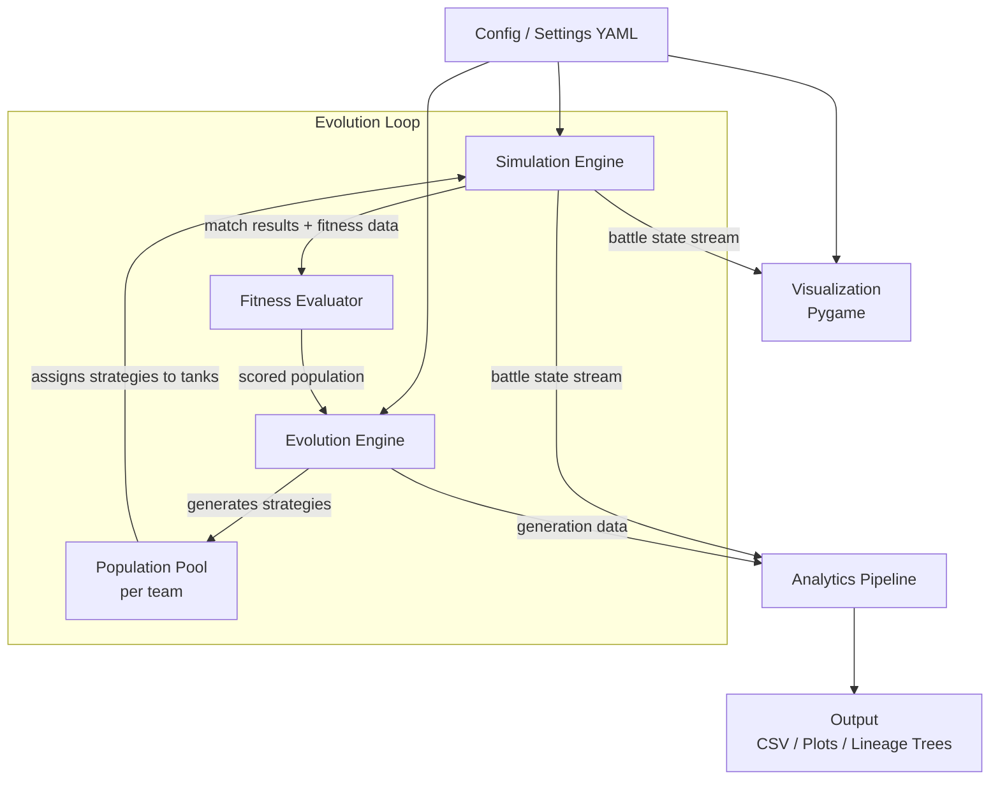

## Subsystem Details

### 1. Configuration System

Single source of truth for all parameters. No magic numbers in code.

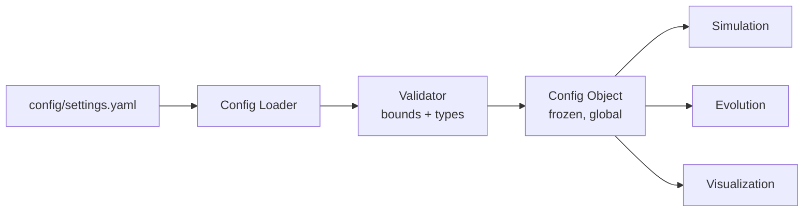

**Key design decisions:**
- YAML for human readability
- Config object is immutable after load — no runtime mutation
- Defaults baked into code, overridden by YAML
- Validation at load time (fail fast on bad config)

### 2. Simulation Engine

Runs a single battle to completion. Stateless between battles — takes a map and a set of tanks with strategies, returns results.

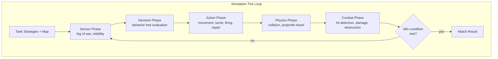

**Tick-based simulation:**
- Fixed timestep (configurable, default: 60 ticks/sec for simulation, decoupled from rendering)
- Each tick runs phases in order: sense → decide → act → physics → combat → check
- Deterministic given same seed + strategies

#### 2.1 Arena / Map

```
┌─────────────────────────────────────┐
│ . . . . W W W . . . . . . . . . .  │  . = open ground
│ . . . . W . . . . . M M . . . . .  │  W = wall (impassable, blocks LOS)
│ . . . . . . . . . . M M . . . . .  │  M = mud (speed × 0.5)
│ R R R R . . . . . . . . . . R R R  │  R = road (speed × 1.3)
│ . . . . . . . W W . . . . . . . .  │
│ . . . . . . . W W . . . . . . . .  │  Size: configurable (min 400×400,
│ . . M M . . . . . . . . W . . . .  │         max 2000×2000, default 800×800)
│ . . M M . . . . . . . . W . . . .  │
└─────────────────────────────────────┘
```

Maps are stored as 2D grids. Preset maps available; random generation possible.

#### 2.2 Tank Model

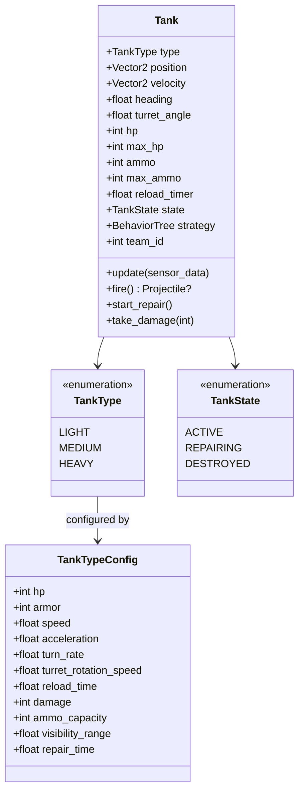

**Default tank type parameters (all configurable):**

| Property          | Light | Medium | Heavy |
|-------------------|-------|--------|-------|
| HP                | 50    | 100    | 200   |
| Armor             | 5     | 15     | 30    |
| Speed             | 5.0   | 3.5    | 2.0   |
| Acceleration      | 3.0   | 2.0    | 1.0   |
| Turn rate (°/s)   | 180   | 120    | 60    |
| Turret rot (°/s)  | 240   | 180    | 90    |
| Reload time (s)   | 8.0   | 12.0   | 20.0  |
| Damage per shot   | 20    | 45     | 100   |
| Ammo              | 20    | 15     | 10    |
| Visibility range  | 250   | 200    | 150   |
| Repair time (s)   | 15.0  | 20.0   | 30.0  |
| Projectile speed  | 10.0  | 8.0    | 6.0   |
| Projectile range  | 300   | 400    | 500   |

**Damage formula:** `effective_damage = max(0, shot_damage - target_armor)`

**Repair mechanics:**
- Repair is **not interruptible** — once a tank commits to repairing, it must complete
- Tank cannot move, rotate, or fire while repairing
- Tank can still take damage (sitting duck)
- If destroyed during repair, state transitions directly to DESTROYED
- Strategic risk/reward: repair gives full HP but costs time and vulnerability

#### 2.3 Fog of War

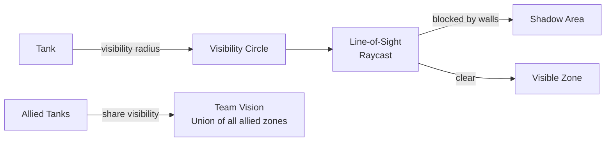

**Sensor data provided to strategy (per visible enemy):**
- Relative position (angle + distance)
- Enemy heading (which way hull faces)
- Enemy turret direction
- Enemy tank type
- Enemy velocity (direction + approximate speed) — needed for lead calculation
- **NOT provided:** enemy HP, enemy ammo

#### 2.4 Spawn Positions

Teams spawn on **opposite sides** of the map. The spawn system:
- Divides the map edges into team zones (2 teams = left vs right, 3+ = distributed around perimeter)
- Validates that spawn positions are on passable terrain
- Ensures minimum distance between spawn points
- Tanks within a team spawn in a cluster (configurable spread)

#### 2.5 Combat

- Projectiles travel in straight line at **configurable speed per tank type**
- Shell speed matters: tanks must **lead their targets** (aim ahead of moving enemies)
- This creates an evolutionary pressure for aiming strategies that account for
  target velocity and shell travel time
- Projectiles blocked by walls
- Friendly fire is ON
- Projectiles despawn after max range
- One projectile per shot (no splash damage for now)

### 3. Strategy Representation — Behavior Trees

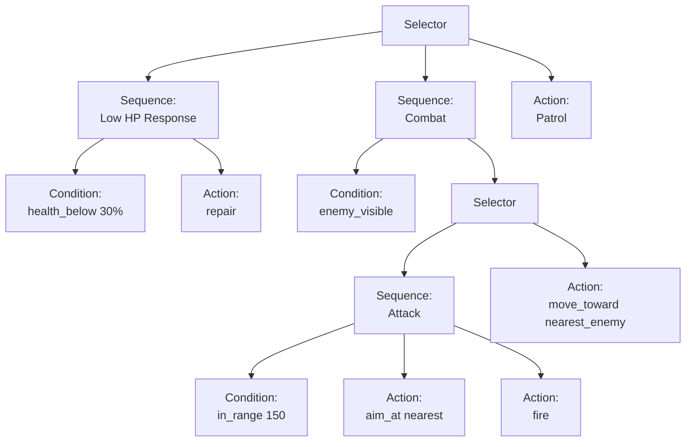

**Node types:**

| Category   | Nodes |
|------------|-------|
| Composite  | `Selector` (try children until one succeeds), `Sequence` (run children until one fails) |
| Condition  | `enemy_visible`, `health_below(%)`, `ammo_below(n)`, `ally_nearby(dist)`, `under_fire`, `turret_aimed_at_me`, `in_range(dist)`, `near_cover(dist)` |
| Action     | `move_toward(target)`, `move_away(target)`, `patrol(pattern)`, `seek_cover`, `aim_at(target_selector)`, `fire`, `repair`, `signal(type)`, `move_to_signal` |

**Target selectors:** `nearest_enemy`, `nearest_ally`, `last_known_enemy`, `signal_position`

**Evolvable parameters:** Every numeric value in the tree (thresholds, distances, priorities) is a gene. The tree structure itself is also evolvable (Phase 2).

### 3.1 Team Composition as Part of the Genome

A strategy genome is not just a behavior tree — it also includes a **composition vector**:

```
Genome = {
    behavior_tree: BehaviorTree,       # How tanks fight
    composition: [2, 2, 1],            # [light, medium, heavy] — must sum to team_size
}
```

The composition vector evolves alongside the behavior tree:
- **Mutation:** Shift one slot from one type to another (e.g., trade a light for a heavy)
- **Crossover:** Blend parent compositions (rounded, clamped to sum constraint)
- This allows evolution to discover that certain behaviors pair better with certain compositions (e.g., aggressive flanking works better with light tanks)

**Aiming and lead calculation:**
The `aim_at` action must account for shell travel time. Sensor data includes enemy velocity, and the strategy's aim logic computes an intercept point based on:
- Distance to target
- Target velocity vector
- Shell speed (depends on firing tank's type)

This creates evolutionary pressure for better prediction — a key differentiator between naive and evolved strategies.

### 4. Evolution Engine

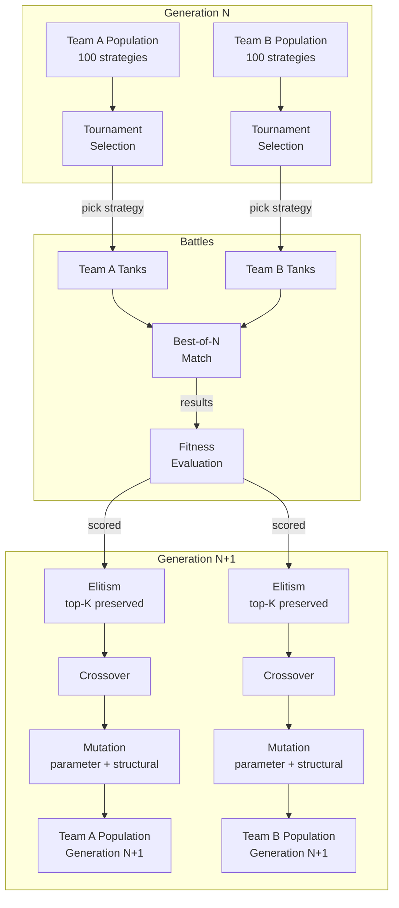

**Tournament selection:**
1. Pick `k` random strategies from population (k = tournament size, configurable)
2. The one with highest fitness wins
3. Repeat to fill next generation (minus elite slots)

**Mutation operators:**
- **Parameter mutation:** Gaussian noise added to numeric parameters (sigma configurable)
- **Structural mutation (Phase 2):**
  - Insert: add a new random node at a random position
  - Delete: remove a node, promote its child
  - Swap: exchange two subtrees within the tree
  - Replace: change a node's type (keeping children if compatible)

**Crossover:**
- Select random subtree from each parent
- Swap subtrees to produce two offspring
- Depth limit to prevent tree bloat (configurable)

### 5. Communication System

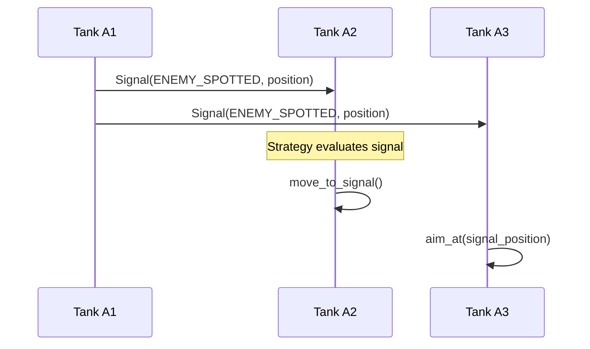

**Signal types:** `ENEMY_SPOTTED`, `HELP`, `REGROUP`, `ATTACK_HERE`
Signals propagate to all allies within visibility range. Strategy decides whether to act on signals.

### 6. Analytics Pipeline

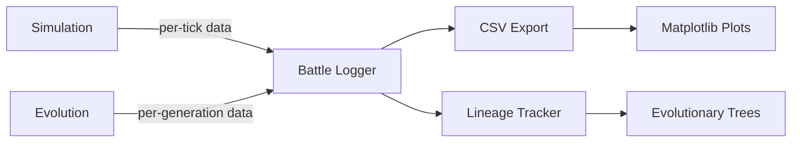

**Tracked metrics:**
- Fitness curves (mean/max/min per generation per team)
- Strategy diversity (tree edit distance distribution)
- Parameter drift (per-parameter time series)
- Lineage trees (parent-child relationships, speciation events)
- Win-rate matrices (archetype vs archetype)
- Signal usage frequency over generations
- Arms race indicators (fitness oscillation between teams)

### 7. Visualization Layer

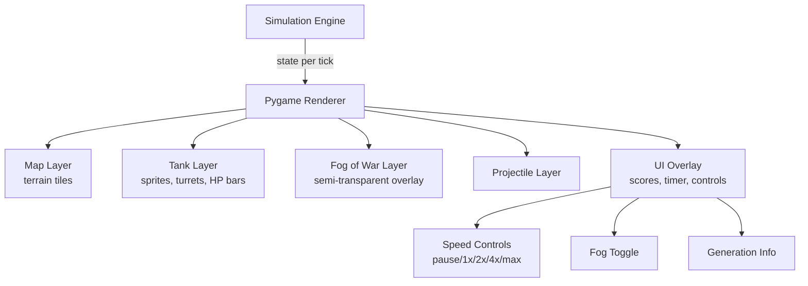

The visualization is **optional** — the simulation runs identically with or without it. The renderer subscribes to simulation state; it never drives it.

## Data Flow Summary

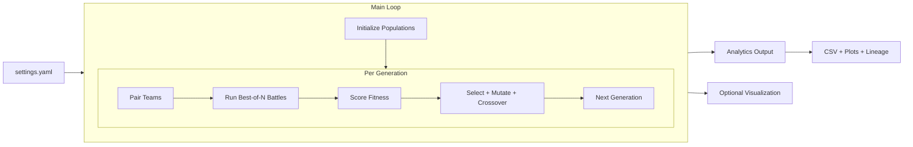

## File Format Specifications

### Settings (YAML)
See `config/settings.yaml` for full schema with defaults.

### Map Format
2D grid stored as plain text or YAML. Each cell is a terrain type character.

### Strategy Serialization
Behavior trees serialized as nested JSON/YAML for storage and replay.

### Lineage Data
JSON lines format — one record per strategy per generation with parent IDs.
